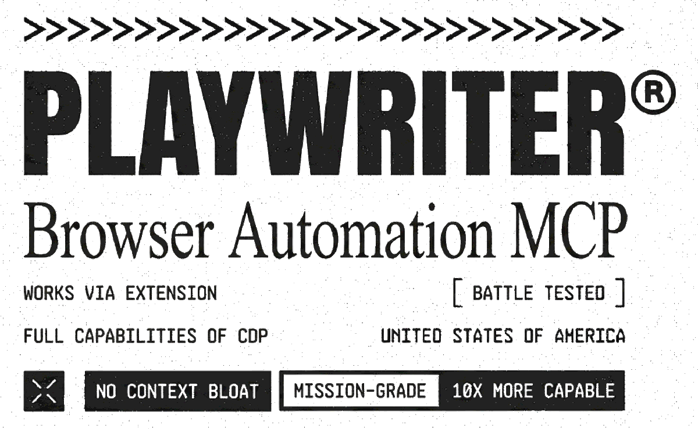

<div align='center'>
    <br/>
    <picture>
        <source media="(prefers-color-scheme: dark)" srcset="banner-dark.png" />
        <source media="(prefers-color-scheme: light)" srcset="banner.png" />
    
    </picture>
    <br/>
    <br/>
    <p>Control your browser via Playwright API. Uses extension + CLI. No context bloat.</p>
    <br/>
</div>

## Installation

1. [**Install Extension**](https://chromewebstore.google.com/detail/playwriter-mcp/jfeammnjpkecdekppnclgkkffahnhfhe) from Chrome Web Store

2. Click extension icon on a tab → turns green when connected

3. Add skill to your agent:
   ```bash
   npx -y skills add remorses/playwriter
   ```

## Quick Start

```bash
playwriter session new  # creates stateful sandbox, outputs session id (e.g. 1)
playwriter -s 1 -e "await page.goto('https://example.com')"
playwriter -s 1 -e "console.log(await accessibilitySnapshot({ page }))"
playwriter -s 1 -e "await page.locator('aria-ref=e5').click()"
```

## CLI Usage

Each session has **isolated state**. Browser tabs are **shared** across sessions.

```bash
# Session management
playwriter session new              # creates stateful sandbox, outputs id (e.g. 1)
playwriter session list             # show sessions + state keys
playwriter session reset <id>       # fix connection issues

# Execute (always use -s)
playwriter -s 1 -e "await page.goto('https://example.com')"
playwriter -s 1 -e "await page.click('button')"
playwriter -s 1 -e "console.log(await page.title())"
```

Create your own page to avoid interference from other agents:

```bash
playwriter -s 1 -e "state.myPage = await context.newPage(); await state.myPage.goto('https://example.com')"
```

Multiline:

```bash
playwriter -s 1 -e $'
const title = await page.title();
console.log({ title, url: page.url() });
'
```

## Examples

**Persist data in state:**
```bash
# Store data across calls
playwriter -s 1 -e "state.users = await page.$$eval('.user', els => els.map(e => e.textContent))"
playwriter -s 1 -e "console.log(state.users)"
```

**Intercept network requests:**
```bash
playwriter -s 1 -e "state.requests = []; page.on('response', r => { if (r.url().includes('/api/')) state.requests.push(r.url()) })"
playwriter -s 1 -e "await page.click('button'); await page.waitForTimeout(1000)"
playwriter -s 1 -e "console.log(state.requests)"
```

**Set breakpoints and debug:**
```bash
playwriter -s 1 -e "state.cdp = await getCDPSession({ page }); state.dbg = createDebugger({ cdp: state.cdp }); await state.dbg.enable()"
playwriter -s 1 -e "state.scripts = await state.dbg.listScripts({ search: 'app' }); console.log(state.scripts.map(s => s.url))"
playwriter -s 1 -e "await state.dbg.setBreakpoint({ file: state.scripts[0].url, line: 42 })"
```

**Live edit page code:**
```bash
playwriter -s 1 -e "state.cdp = await getCDPSession({ page }); state.editor = createEditor({ cdp: state.cdp }); await state.editor.enable()"
playwriter -s 1 -e "await state.editor.edit({ url: 'app.js', oldString: 'DEBUG=false', newString: 'DEBUG=true' })"
```

**Screenshot with labels:**
```bash
playwriter -s 1 -e "await screenshotWithAccessibilityLabels({ page })"
```

## MCP Setup

See [MCP.md](./MCP.md) for MCP server configuration and remote agent setup.

## Visual Labels

Vimium-style labels for AI agents to identify elements:

```javascript
await screenshotWithAccessibilityLabels({ page })
// Returns screenshot + accessibility snapshot with aria-ref selectors
await page.locator('aria-ref=e5').click()
```

Color-coded: yellow=links, orange=buttons, coral=inputs, pink=checkboxes, peach=sliders, salmon=menus, amber=tabs.

## Comparison

### vs Playwright MCP

| | Playwright MCP | Playwriter |
|---|---|---|
| Browser | Spawns new Chrome | Uses your Chrome |
| Extensions | None | Your existing ones |
| Login state | Fresh | Already logged in |
| Bot detection | Always detected | Can bypass (disconnect extension) |
| Collaboration | Separate window | Same browser as user |

### vs BrowserMCP

| | BrowserMCP | Playwriter |
|---|---|---|
| Tools | 12+ dedicated tools | 1 `execute` tool |
| API | Limited actions | Full Playwright |
| Context usage | High (tool schemas) | Low |
| LLM knowledge | Must learn tools | Already knows Playwright |

### vs Antigravity (Jetski)

| | Jetski | Playwriter |
|---|---|---|
| Tools | 17+ tools | 1 tool |
| Subagent | Spawns for each browser task | Direct execution |
| Latency | High (agent overhead) | Low |

### vs Claude Browser Extension

| | Claude Extension | Playwriter |
|---|---|---|
| Agent support | Claude only | Any MCP client |
| Windows WSL | No | Yes |
| Context method | Screenshots (100KB+) | A11y snapshots (5-20KB) |
| Playwright API | No | Full |
| Debugger/breakpoints | No | Yes |
| Live code editing | No | Yes |
| Network interception | Limited | Full |
| Raw CDP access | No | Yes |

## Architecture

```
+---------------------+     +-------------------+     +-----------------+
|   BROWSER           |     |   LOCALHOST       |     |   MCP CLIENT    |
|                     |     |                   |     |                 |
|  +---------------+  |     | WebSocket Server  |     |  +-----------+  |
|  |   Extension   |<--------->  :19988         |     |  | AI Agent  |  |
|  +-------+-------+  | WS  |                   |     |  +-----------+  |
|          |          |     |  /extension       |     |        |        |
|    chrome.debugger  |     |       |           |     |        v        |
|          v          |     |       v           |     |  +-----------+  |
|  +---------------+  |     |  /cdp/:id <--------------> |  execute  |  |
|  | Tab 1 (green) |  |     +-------------------+  WS |  +-----------+  |
|  | Tab 2 (green) |  |                               |        |        |
|  | Tab 3 (gray)  |  |     Tab 3 not controlled      |  Playwright API |
+---------------------+     (no extension click)      +-----------------+
```

## Remote CLI

Run CLI from a different machine (devcontainer, VM, SSH) while Chrome runs on your host.

**On host:**
```bash
playwriter serve --token <secret>
```

**From remote:**
```bash
playwriter --host 192.168.1.10 --token <secret> session new
playwriter --host 192.168.1.10 --token <secret> -s 1 -e "await page.goto('https://example.com')"
```

Or with env vars:
```bash
export PLAYWRITER_HOST=192.168.1.10
export PLAYWRITER_TOKEN=<secret>
playwriter -s 1 -e "await page.goto('https://example.com')"
```

## Security

- **Local only**: WebSocket server on `localhost:19988`
- **Origin validation**: Only our extension IDs allowed (browsers can't spoof Origin)
- **Explicit consent**: Only tabs where you clicked the extension icon
- **Visible automation**: Chrome shows automation banner on controlled tabs
- **No remote access**: Malicious websites cannot connect

## Playwright API

Connect programmatically (without CLI):

```typescript
import { chromium } from 'playwright-core'
import { startPlayWriterCDPRelayServer, getCdpUrl } from 'playwriter'

const server = await startPlayWriterCDPRelayServer()
const browser = await chromium.connectOverCDP(getCdpUrl())
const page = browser.contexts()[0].pages()[0]

await page.goto('https://example.com')
await page.screenshot({ path: 'screenshot.png' })
// Don't call browser.close() - it closes the user's Chrome
server.close()
```

Or connect to a running server:

```bash
npx -y playwriter serve --host 127.0.0.1
```

```typescript
const browser = await chromium.connectOverCDP('http://127.0.0.1:19988')
```

## Known Issues

- If all pages return `about:blank`, restart Chrome (Chrome bug in `chrome.debugger` API)
- Browser may switch to light mode on connect ([Playwright issue](https://github.com/microsoft/playwright/issues/37627))
